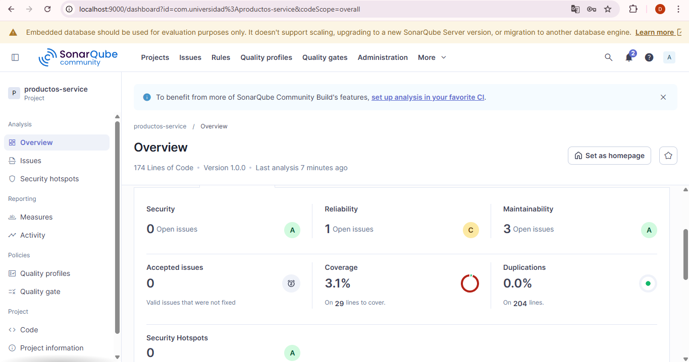
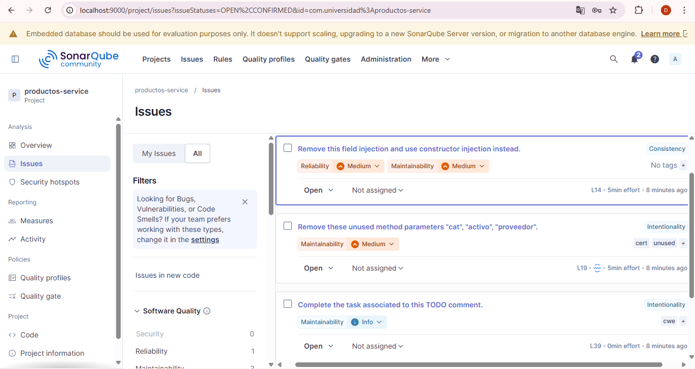

# Productos Service — Analisis SonarQube
### MARIA JOSE CRUZ - 02230131003
## Objetivo
Configurar SonarQube y JaCoCo, ejecutar el analisis inicial y documentar hallazgos.

## Estado inicial del analisis
| Categoria | Cantidad | Rating |
|-----------|----------|--------|
| Bugs | X | ? |
| Vulnerabilidades | X | ? |
| Code Smells | X | ? |
| Cobertura | X% | — |

## Hallazgos principales identificados
### Bug 1: Retorno de valor null
- Archivo: ProductoService.java, línea 40
- Descripción: El método buscar() retorna null cuando el producto no existe en lugar de lanzar una excepción, lo que puede causar NullPointerException en quien llame al método.
- Severidad: Major

### Code Smell 1: Inyección de dependencia con @Autowired en campo
- Archivo: ProductoService.java, línea 14
- Descripción: El repositorio se inyecta directamente en el campo en lugar de usar inyección por constructor, lo que dificulta las pruebas unitarias.

### Code Smell 2: Método con múltiples responsabilidades
- Archivo: ProductoService.java, línea 18
- Descripción: El método procesarProducto() tiene demasiadas responsabilidades y complejidad ciclomática alta.

## Capturas del dashboard

## Ejecucion local
1. Levantar SonarQube con Docker.
2. Ejecutar `mvn clean verify`.
3. Ejecutar `mvn sonar:sonar -Dsonar.token=TU_TOKEN`.
